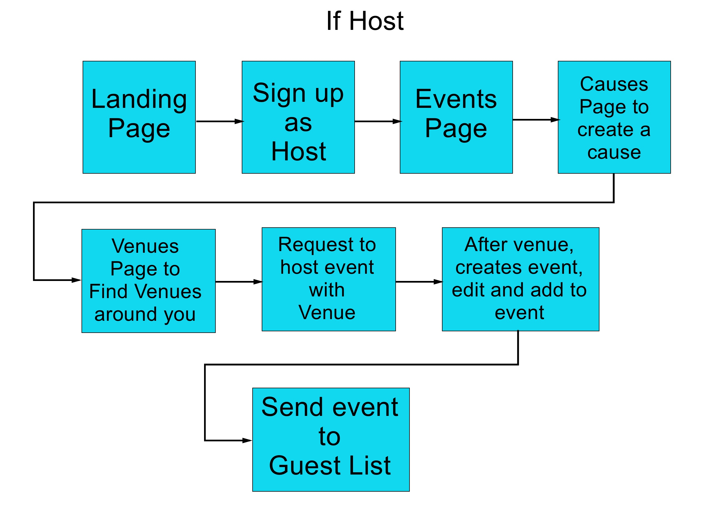
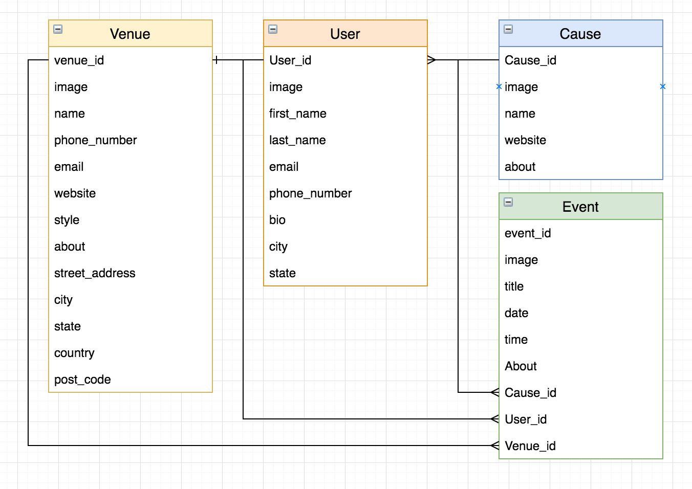

# README

# Overview

1. Summary
2. Installation
3. User Stories
4. Wireframing
5. Workflow Diagram
6. Entity Relationship Diagram
7. List of Tools Used
8. Future Updates

-----
## 1. Summanry
This app was designed as part of the CoderAcademy assignment to build a two-sided marketplace.
PROBLEM DEFINITION: Creating fundraising events for local charities, schools, or causes can be very time consuming and complex. To organise such an event usually replies on many differnt revenue streams. Finding a venue to host the event can be costly and difficult to schedule.

SOLUTION: GRaise is design to take most of the headache of planning fundraising events and redesign how the money is raised. The app is designed so that a user who wants to raise money for a cause cans sign on to become a host and find venues(restaurant, bar, etc) in their area who are wanting to host events. The venues will see an influx of customers during the event and bring in people who may have never been to their establishment. In return, the venue will donate a portion of the proceeds to the host's cause.

-----
## 2. Installation
Configuration - you will not have an ENV file as this has been ignored through Git. In order to run the App you will need to create a .env file with your own mailgun and stripe API keys.

1. Clone the repo then change into the directory.
2. Run `bundle install` in terminal.
3. Run `rails db:migrate` in terminal.
4. Create a `.env` file in the root of the directory, then add your own ENV variables:
   + `CLOUDINARY_API_SECRET=XXXX`
   + `CLOUDINARY_API_KEY=XXXX`
   + `CLOUDINARY_CLOUD_NAME=XXXX`
   + `GMAIL_USERNAME=XXXX`
   + `GMAIL_PASSWORD=XXXX`
   + `PUBLISHABLE_KEY=XXXX`
   + `SECRET_KEY=XXXX`
   + `GOOGLE_MAP_API=XXXX`

-----
## 3. User Stories

-----
## 4. Wireframing

-----
## 5. Workflow Diagrams

-----
## 6. Entity Relationship Diagram

-----
## 7 List of Tools Used
1. Github - Version control, user stories and to assign story points for project management.
2. Draw.io - ERD
3. postgresql - Database
4. Devise - authentication
5. Sketch - Workflow Diagrams, Wireframing
6. Cloudinary - image uploads
7. Webhosting - Heroku
8. Gmail - emails
9. Stripe - payments
10. dotenv-rails - environmental variables
11. geocoder - longitude latitude geocoding
12. Google Maps - map locations
13. Peer code review

-----
## 8 Future Updates

1. Implement messaging between hosts and venues
2. Implement filtering by location
3. Implement page where venues can accept or deny a host's request for an event
4. Allow a venue to post their availability on a calendar that is visible to hosts
5. Allow venues to donate funds to cause through app and display funds donated on venue page
6. Implement list of host who support a cause on the cause's page
